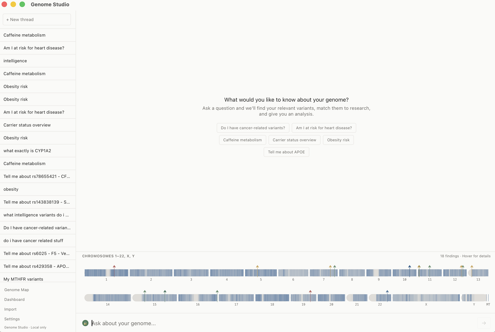
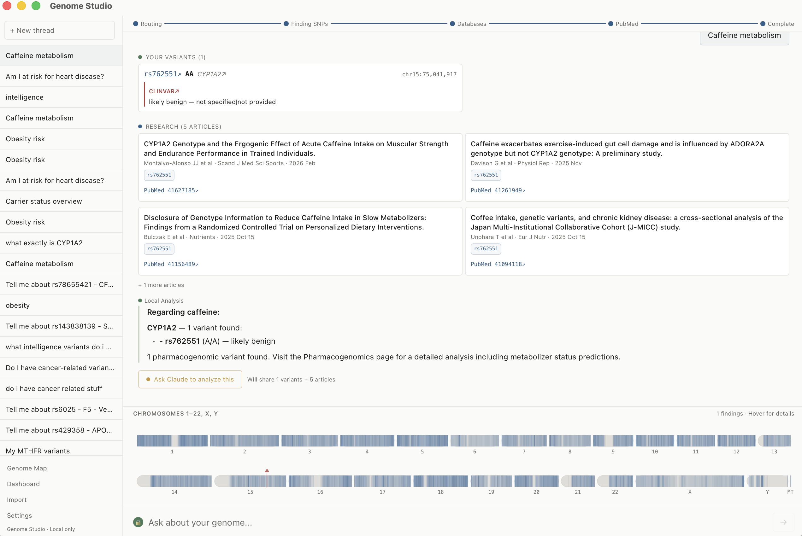
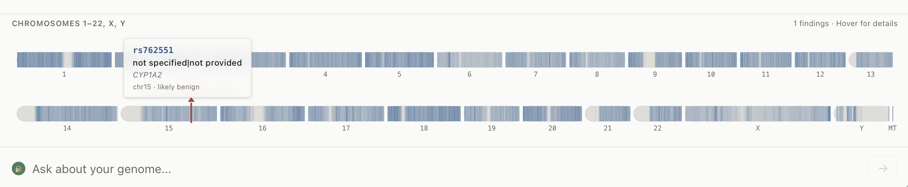

# SovereignDNA

**Your genome, your device. No cloud. No telemetry. No compromise.**

SovereignDNA is a fully local DNA analysis application that turns your raw genetic data (23andMe, AncestryDNA, VCF) into actionable insights — without your genomic data ever leaving your machine.

## Screenshots

| Research Workbench | Analysis Results |
|---|---|
|  |  |



## Why

You downloaded your raw data from 23andMe. Now what? Cloud services want you to upload it again. SovereignDNA keeps it local and gives you:

- **Research workbench** — Ask questions about your genome, get answers grounded in your actual variants and the latest published research
- **Live analysis** — Health risks, pharmacogenomics, traits, carrier status, ancestry — all computed locally in Rust
- **Research feed** — Daily scanning of PubMed for new studies matching YOUR specific variants
- **Optional AI** — Connect Claude for deeper interpretation, with explicit per-query data approval (you choose exactly what gets shared)
- **Genome map** — Interactive karyogram showing where your findings are across all chromosomes

## Privacy Architecture

```
Your machine
├── Your genome data (SQLite, never transmitted)
├── Reference databases (ClinVar, GWAS Catalog, SNPedia — downloaded once)
├── Local analysis (Rust, no network)
├── Local LLM (Ollama, if installed)
└── Research feed (fetches public PubMed articles, matches locally)
    ↑
    Only public rsIDs used in search queries
    Your genotype data NEVER leaves the device
```

The Claude integration is **opt-in, per-query, with explicit approval**. You see exactly which variants will be shared before confirming. Your full genome (600K+ variants) always stays local.

## Quick Start

### Prerequisites

- [Node.js](https://nodejs.org/) 18+
- [Rust](https://rustup.rs/) 1.77+
- macOS (Apple Silicon or Intel)

### Build & Run

```bash
git clone https://github.com/anthropics/sovereign-dna.git
cd sovereign-dna
npm install
npm run tauri dev
```

### Production Build

```bash
npm run tauri build
# Output: src-tauri/target/release/bundle/macos/Genome Studio.app
```

### Import Your Data

1. Download your raw data from [23andMe](https://you.23andme.com/tools/data/download/)
2. Open SovereignDNA
3. Drop the file or click Import
4. Reference databases download automatically (ClinVar, GWAS Catalog, SNPedia)
5. Start asking questions

## Architecture

| Layer | Technology | Purpose |
|---|---|---|
| Backend | Rust + Tauri 2.0 | Parsing, analysis, database, privacy enforcement |
| Frontend | React 19 + TypeScript | Research workbench, visualizations |
| Database | SQLite (WAL mode) | Genome storage, reference data, session history |
| Visualizations | D3.js + Canvas | Karyogram, evidence cards |
| Local AI | Ollama (optional) | Local LLM for genome interpretation |
| Remote AI | Claude API (optional) | Deeper analysis with explicit consent |

### Project Structure

```
src-tauri/src/           # Rust backend
├── parser/              # 23andMe, AncestryDNA, VCF parsers
├── db/                  # SQLite schema, queries, migrations
├── analysis/            # Health risk, pharmacogenomics, traits, ancestry, carrier
├── research/            # PubMed scanner, workbench pipeline, intent parsing
├── reference/           # ClinVar, GWAS Catalog, SNPedia downloaders/parsers
├── commands/            # Tauri IPC command handlers
└── report/              # PDF report generation

src/                     # React frontend
├── pages/               # Research workbench, genome map, settings, import
├── visualizations/      # Karyogram, Manhattan plot, chromosome browser
├── design-system/       # Feltron/Tufte-inspired components
├── hooks/               # Tauri bridge, data loading
├── stores/              # Zustand state management
└── lib/                 # Type definitions, formatters, constants
```

## Reference Databases

Downloaded automatically on first use (no user data sent):

| Database | Source | What it provides |
|---|---|---|
| ClinVar | NCBI | Variant-disease associations, pathogenicity |
| GWAS Catalog | EBI | Trait associations from genome-wide studies |
| SNPedia | Community | Curated plain-language SNP annotations |

## Local LLM Support

If [Ollama](https://ollama.ai/) is installed and running, SovereignDNA uses it for local genome interpretation. Supported models (in preference order): llama3.2, llama3.1, mistral, phi3, gemma2.

If Ollama is not available, falls back to a built-in structured query engine.

## Contributing

Contributions welcome. The codebase is ~19K lines (11K Rust, 8K TypeScript).

Key areas for contribution:
- Additional analysis modules (polygenic risk scores, HLA typing)
- More reference database integrations
- Windows/Linux packaging
- Improved local LLM prompting
- Additional file format parsers

## Disclaimer

SovereignDNA is for **educational and informational purposes only**. It is not a medical device and should not be used for clinical decision-making. Always consult a healthcare provider or genetic counselor for medical interpretation of genetic data.

## License

MIT — see [LICENSE](LICENSE)
